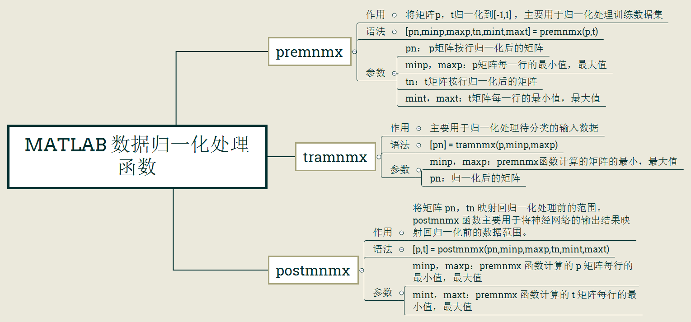

# Matlab

- ### [《Matlab 与机器学习》](《Matlab与机器学习》matlab_geeker)

    [MATLAB 入门基础.pdf](《Matlab与机器学习》matlab_geeker/MATLAB入门基础.pdf)

    [MATLAB 进阶与提高.pdf](《Matlab与机器学习》matlab_geeker/MATLAB进阶与提高.pdf)

- ### 杂记

    + 矩阵取整行 / 整列

            第二列
                A(:,2)
            第二行
                A(2,:)
            第二行到第四行
                A(2:4,:)

    + 画图

            plot()          # 一维 / 二维
            plot3()         # 三维

            grid on         # 描绘出网格
            hold on         # 停留在图中

    + 归一化

        
