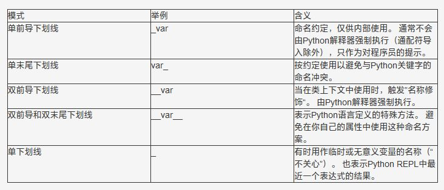

# Python 中下划线的 5 种含义

    单前导下划线：_var
    单末尾下划线：var_
    双前导下划线：__var
    双前导和末尾下划线：__var__
    单下划线：_

- ### 单前导下划线 _var

    单个下划线是一个Python命名约定，表示这个名称是供内部使用的。 它通常不由Python解释器强制执行，仅仅作为一种对程序员的提示。

    但是，前导下划线的确会影响从模块中导入名称的方式。 

    > 如果使用通配符从模块中导入所有名称，则Python不会导入带有前导下划线的名称（除非模块定义了覆盖此行为的__all__列表）

- ### 单末尾下划线 var_

    单个末尾下划线（后缀）是一个约定，用来避免与Python关键字产生命名冲突。

- ### 双前导下划线 __var

    双下划线前缀会导致Python解释器重写属性名称，以避免子类中的命名冲突。

    这也叫做名称修饰（name mangling） - 解释器更改变量的名称，以便在类被扩展的时候不容易产生冲突。

- ### 双前导和双末尾下划线 _var_

    如果一个名字同时以双下划线开始和结束，则不会应用名称修饰。 由双下划线前缀和后缀包围的变量不会被Python解释器修改。

    最好避免在自己的程序中使用以双下划线（“dunders”）开头和结尾的名称，以避免与将来Python语言的变化产生冲突。

- ### 单下划线 _

    有时候单个独立下划线是用作一个名字，来表示某个变量是临时的或无关紧要的。

    也可以在拆分(unpacking)表达式中将单个下划线用作“不关心的”变量，以忽略特定的值。

    单个下划线仅仅是一个有效的变量名称，会有这个用途而已。

    除了用作临时变量之外，“_”是大多数Python REPL中的一个特殊变量，它表示由解释器评估的最近一个表达式的结果。

    这样就很方便了，比如你可以在一个解释器会话中访问先前计算的结果，或者，你是在动态构建多个对象并与它们交互，无需事先给这些对象分配名字。
